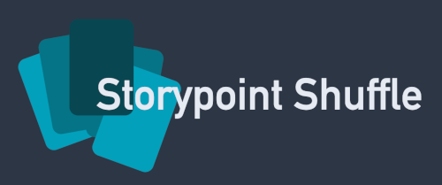

A collaborative story point voting app built with Rust (Axum, Socketioxide) and React.

## Features

- Real-time story point voting using WebSockets
- Room and player management
- Frontend built with React and Tailwind CSS
- Backend API and static file serving with Axum and websockets using Socketioxide

## Getting Started

### Setup

1. Install Rust: https://rustup.rs
2. Install Bun: https://bun.sh
3. Install frontend dependencies:
   ```sh
   cd frontend
   bun install
   ```
4. Create a `.env` file in the `frontend` directory with the following content (change as needed for your setup)
   ```
   VITE_SITE_URL=http://localhost:5173
   VITE_SOCKET_URL=http://localhost:3333
   ```

## Development

- Start the backend: `cargo run`
- Start the frontend (from the `frontend` directory): `bun run dev`

## License

Made available under the MIT license see the LICENSE file for full details.
